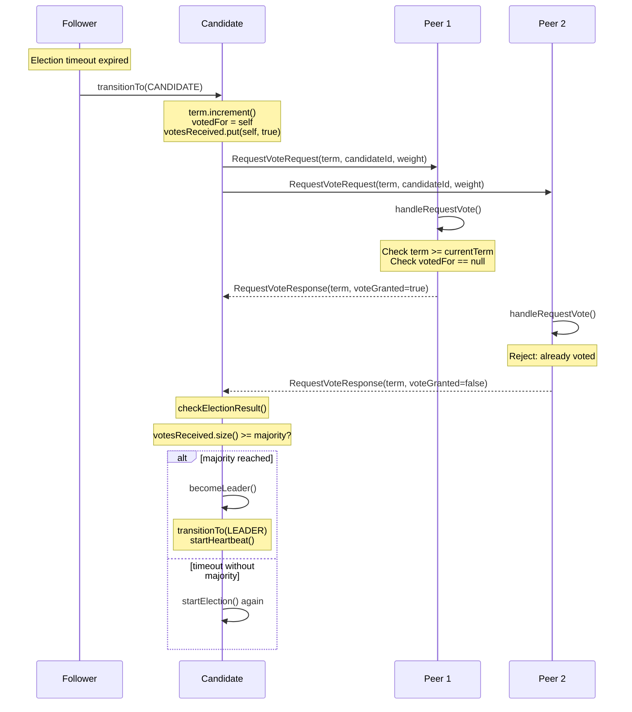

# Speedboat Raft 算法实现文档

> 基于 Raft 共识算法的分布式主节点选举与锁控框架核心算法实现。

---

## 目录

1. [Raft Leader Election 算法](#1-raft-leader-election-算法)
2. [Heartbeat 心跳机制](#2-heartbeat-心跳机制)
3. [Log Replication 日志复制](#3-log-replication-日志复制)
4. [Distributed Lock 分布式锁](#4-distributed-lock-分布式锁)
5. [Voting Weight Strategy 投票权重策略](#5-voting-weight-strategy-投票权重策略)
6. [Membership Change 成员变更](#6-membership-change-成员变更)
7. [CustomSerializer 序列化协议](#7-customserializer-序列化协议)
8. [算法复杂度总览](#8-算法复杂度总览)
9. [边界条件与容错](#9-边界条件与容错)
10. [优化方向](#10-优化方向)

---

## 1. Raft Leader Election 算法

### 1.1 算法目的

在分布式集群中通过 Raft 共识协议选出一个唯一的 Leader 节点，确保集群在任何时刻最多只有一个 Leader 处理客户端请求。

### 1.2 触发条件

- Follower 节点在选举超时（`electionTimeout`）内未收到 Leader 的心跳
- 超时时间随机化在 `[minTimeout, maxTimeout)` 范围内，避免 split vote

### 1.3 输入/输出

| 项目 | 描述 |
|------|------|
| **输入** | 当前节点状态为 FOLLOWER，`lastHeartbeatNanos` 距当前时间超过 `electionTimeout` |
| **输出** | 选举成功 → 节点状态变为 LEADER；选举失败 → 保持或变为 FOLLOWER |
| **消息** | `RequestVoteRequest`(term, candidateId, voteWeight) → `RequestVoteResponse`(term, voteGranted) |

### 1.4 算法流程



### 1.5 核心代码

#### 选举发起 (`RaftNode.java:297`)

```java
public void startElection() {
    if (currentState != NodeState.FOLLOWER && currentState != NodeState.CANDIDATE) {
        return;
    }
    transitionTo(NodeState.CANDIDATE);
    votesReceived.put(nodeId, true);

    int voteWeight = calculateTotalVoteWeight();
    int votesNeeded = calculateVotesNeeded();

    if (voteWeight >= votesNeeded) {
        becomeLeader();
        return;
    }
    requestVotesFromPeers(votesNeeded);
}
```

#### 投票处理 (`RaftNode.java:183`)

```java
public synchronized RequestVoteResponse handleRequestVote(RequestVoteRequest request) {
    if (term.isMonotonicViolation(request.getTerm())) {
        return new RequestVoteResponse(term.getCurrent(), false);
    }
    if (request.getTerm() > term.getCurrent()) {
        term.updateIfHigher(request.getTerm());
        if (currentState != NodeState.FOLLOWER) {
            transitionTo(NodeState.FOLLOWER);
        }
        votedFor = null;
        votedForTerm = -1;
        leaderId = null;
    }
    boolean canVote = (votedFor == null || votedFor.equals(request.getCandidateId()))
        && votedForTerm != term.getCurrent();

    if (canVote && request.getTerm() >= term.getCurrent()) {
        votedFor = request.getCandidateId();
        votedForTerm = term.getCurrent();
        resetElectionTimeout();
        return new RequestVoteResponse(term.getCurrent(), true);
    }
    return new RequestVoteResponse(term.getCurrent(), false);
}
```

#### 异步投票收集 (`RaftNode.java:319`)

```java
private void requestVotesFromPeers(int votesNeeded) {
    for (String peerId : peerIds) {
        RequestVoteRequest request = new RequestVoteRequest(
            term.getCurrent(), nodeId, calculateTotalVoteWeight());
        transportLayer.sendRequestVote(peerId, request)
            .thenAccept(response -> {
                if (response.isVoteGranted() && currentState == NodeState.CANDIDATE) {
                    synchronized (votesReceived) {
                        votesReceived.put(peerId, true);
                        checkElectionResult(votesNeeded);
                    }
                } else if (response.getTerm() > term.getCurrent()) {
                    term.updateIfHigher(response.getTerm());
                    transitionTo(NodeState.FOLLOWER);
                }
            });
    }
    scheduler.schedule(() -> {
        if (currentState == NodeState.CANDIDATE) {
            startElection();
        }
    }, electionTimeout.getNext(), TimeUnit.MILLISECONDS);
}
```

### 1.6 选举结果判定

```java
private synchronized void checkElectionResult(int votesNeeded) {
    if (currentState != NodeState.CANDIDATE) return;
    int currentVotes = votesReceived.size();
    if (currentVotes >= votesNeeded) {
        becomeLeader();
    }
}
```

**majority 计算** (`RaftNode.java:618`):

```java
private int calculateVotesNeeded() {
    int totalNodes = peerIds.size() + 1;
    return (totalNodes / 2) + 1;
}
```

### 1.7 权重加速

当候选人的 `calculateTotalVoteWeight()` 结果 >= majority 时，跳过广播直接成为 Leader：

```java
if (voteWeight >= votesNeeded) {
    becomeLeader();
    return;
}
```

### 1.8 复杂度分析

| 维度 | 复杂度 | 说明 |
|------|--------|------|
| 消息数 | O(N) | 向 N-1 个 peer 广播 RequestVote |
| 本地处理 | O(1) | 每次投票决策为常数时间 |
| 选举延迟 | O(1) 网络往返 | 一轮 RPC 即可完成选举 |
| 存储 | O(N) | votesReceived map 存储 N 个节点的投票状态 |

---

