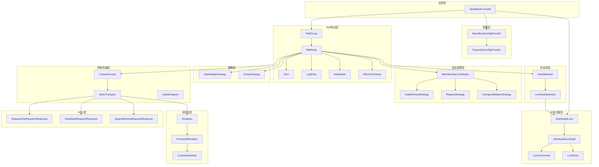
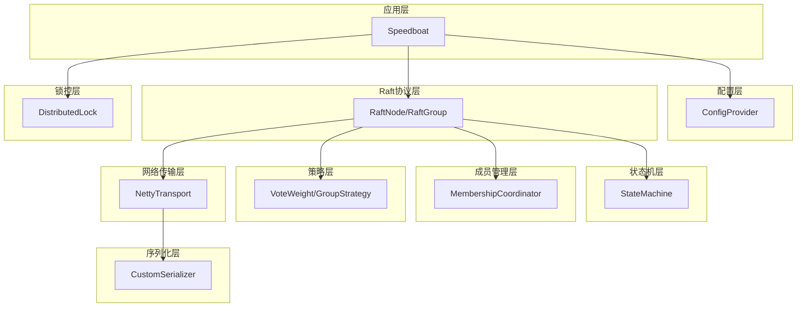
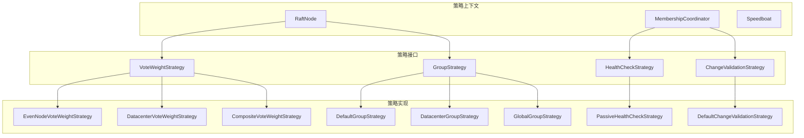
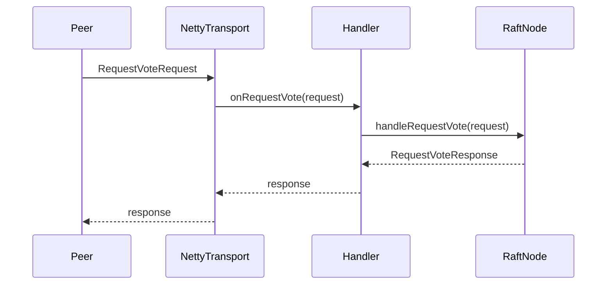
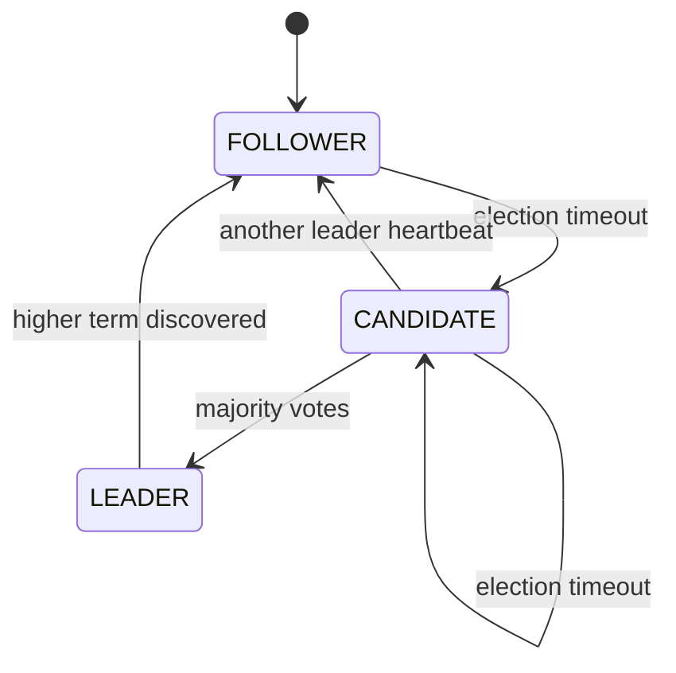
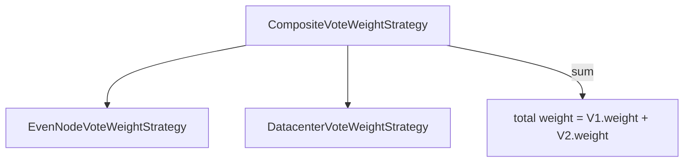

# Speedboat 架构设计总结

## 项目概述

**Speedboat** 是一个基于 Raft 共识算法的分布式主节点选举和分布式锁框架，采用 Java 8 + Netty 4.1.68 + Protostuff 1.7.4 技术栈，支持单机房/跨机房自动模式切换，提供极简 API 一行启动。

**核心特性**：
- 亚秒级/亚毫秒级主从切换（单机房 150-300ms，同城 200-500ms，异地 500-1000ms）
- 基于权重的投票策略，解决偶数节点平票问题
- 级联架构支持跨机房容错
- 分布式锁基于 Raft 日志一致性
- 成员变更与健康检测

---

## 架构全景图



---

## 核心架构模式

### 模式1: 分层架构（Layered Architecture）

#### 模式描述

Speedboat 采用清晰的分层架构，每层职责明确，单向依赖（上层依赖下层，下层不依赖上层）。共划分为 9 层：

| 层级 | 名称 | 核心职责 |
|------|------|----------|
| L1 | 应用层 | 统一 API 门面，对外暴露 |
| L2 | 配置层 | 配置加载与策略注入 |
| L3 | Raft协议层 | 核心共识算法实现 |
| L4 | 状态机层 | 日志应用与业务状态维护 |
| L5 | 分布式锁层 | 锁控逻辑与租约管理 |
| L6 | 成员管理层 | 健康检测与动态成员变更 |
| L7 | 策略层 | 可插拔的策略抽象 |
| L8 | 网络传输层 | TCP 连接与 RPC 通信 |
| L9 | 序列化层 | 对象序列化与协议封装 |

#### 架构图



#### 核心组件

| 组件名称 | 职责 | 依赖 | 接口 |
|----------|------|------|------|
| Speedboat | 门面入口，启动/停止/获取锁 | RaftGroup, DistributedLock | start(), shutdown(), isMain(), getLock() |
| SpeedboatConfigProvider | 配置抽象接口 | PropertiesConfigProvider | getNodeId(), getPeers(), getGroupStrategy() |
| RaftNode | 单节点 Raft 状态机 | Term, NodeState, TransportLayer, StateMachine | startElection(), sendHeartbeat(), propose() |
| StateMachine | 日志应用抽象 | LockStateMachine | apply(), snapshot(), restore() |
| DistributedLock | 分布式锁接口 | DistributedLockImpl | tryLock(), unlock(), isLocked() |
| MembershipCoordinator | 成员变更协调 | RaftNode, HealthCheckStrategy | start(), stop(), proposeAddMember() |
| VoteWeightStrategy | 投票权重策略 | VoteContext | calculateAdditionalWeight() |
| TransportLayer | 传输抽象 | NettyTransport | sendRequestVote(), sendHeartbeat() |
| CustomSerializer | 协议封装 | ProtostuffSerializer | wrap(), unwrap() |

#### 设计决策

| 决策点 | 选择方案 | 选择理由 | 替代方案 |
|--------|----------|----------|----------|
| 分层数量 | 9层 | 职责细化，便于独立测试和替换 | 5层（粗粒度） |
| 依赖方向 | 单向向下 | 防止循环依赖，降低耦合 | 双向依赖（更灵活但易混乱） |
| 状态管理 | 集中在RaftNode | 单一状态中心，易于维护 | 分散到各组件 |

#### 优缺点分析

| 维度 | 优点 | 缺点 |
|------|------|------|
| 可维护性 | 层次清晰，职责明确 | 层间调用链较长 |
| 可测试性 | 每层可独立Mock | 需要多层协作测试 |
| 可扩展性 | 策略层可插拔 | 新增层需调整调用链 |

#### 适用场景

分布式系统需要共识协议的场景：主节点选举、分布式锁、配置同步、元数据管理。

---

### 模式2: 策略模式（Strategy Pattern）

#### 模式描述

通过接口抽象策略行为，具体策略实现可插拔替换，实现行为与算法的解耦。Speedboat 共定义 7 个策略接口：

| 策略接口 | 用途 | 实现类 |
|----------|------|--------|
| VoteWeightStrategy | 投票权重计算 | EvenNodeVoteWeightStrategy, DatacenterVoteWeightStrategy, CompositeVoteWeightStrategy |
| GroupStrategy | 组配置策略 | DefaultGroupStrategy, DatacenterGroupStrategy, GlobalGroupStrategy |
| HealthCheckStrategy | 健康检测 | PassiveHealthCheckStrategy |
| RegistryStrategy | 注册中心 | NoOpRegistryStrategy |
| ChangeValidationStrategy | 变更验证 | DefaultChangeValidationStrategy |
| SpeedboatConfigProvider | 配置来源 | PropertiesConfigProvider |
| Serializer | 序列化 | ProtostuffSerializer |

#### 架构图



#### 核心组件

| 组件 | 职责 | 策略注入方式 |
|------|------|--------------|
| RaftNode | 调用 VoteWeightStrategy 计算权重 | Builder 模式注入 |
| MembershipCoordinator | 调用健康检测/注册/验证策略 | 从 RaftNode 获取 |
| Speedboat | 加载 SpeedboatConfigProvider | 构造时指定 |

#### 设计决策

| 决策点 | 选择方案 | 选择理由 | 替代方案 |
|--------|----------|----------|----------|
| 策略数量 | 7个接口 | 覆盖所有可变行为 | 合并为 2-3 个大接口 |
| 策略注入 | Builder模式 | 灵活配置，避免构造器参数爆炸 | Setter 注入 |
| 默认策略 | 提供默认实现 | 便于快速启动 | 强制用户指定 |

#### 适用场景

需要多种算法切换、跨机房权重差异、健康检测方式差异的场景。

---

### 模式3: Builder 模式

#### 模式描述

通过 Builder 类分步构建复杂对象，支持链式调用，解决构造器参数过多问题。

**使用位置**：
- `RaftNode.Builder` - 构建 RaftNode（12+ 配置项）
- `SpeedboatConfig.Builder` - 构建配置（nodeId, peers, strategies）
- `MembershipConfig.Builder` - 构建成员变更配置（threshold, interval, enabled）

#### 架构图

```mermaid
graph LR
    B[Builder] -->|build()| R[RaftNode]
    
    B -->|nodeId| B
    B -->|peerIds| B
    B -->|electionTimeout| B
    B -->|voteWeightStrategy| B
    B -->|transportLayer| B
    B -->|stateMachine| B
    B -->|maxLogSize| B
```

#### 核心代码

```java
RaftNode node = new RaftNode.Builder()
    .nodeId("node-1")
    .peerIds(Arrays.asList("node-2", "node-3"))
    .electionTimeout(new ElectionTimeout(150, 300))
    .voteWeightStrategy(new CompositeVoteWeightStrategy(...))
    .transportLayer(nettyTransport)
    .stateMachine(lockStateMachine)
    .build();
```

#### 适用场景

对象配置项多、需要灵活组合配置的场景。

---

### 模式4: 单例模式（Singleton Pattern）

#### 模式描述

Speedboat 门面类采用单例模式，确保全局只有一个 Speedboat 实例管理所有组件。

**实现方式**：`Speedboat.INSTANCE` 静态字段 + `getInstance()` 方法。

#### 架构图

```mermaid
graph TD
    S1[Speedboat.INSTANCE] --> RG[RaftGroup]
    S1 --> LC[lockCache]
    S1 --> NODES[NodeInfo List]
    
    C[Client] -->|getInstance()| S1
```

#### 设计决策

| 决策点 | 选择方案 | 选择理由 | 替代方案 |
|--------|----------|----------|----------|
| 实例数量 | 单例 | 简化API，避免多实例冲突 | 多实例（支持多Raft组） |
| 线程安全 | 饿汉式静态初始化 | JVM保证线程安全 | 懒汉式双重检查锁 |

#### 适用场景

一个 JVM 进程只需一个 Speedboat 实例的场景。

---

### 模式5: 观察者模式（Observer Pattern）

#### 模式描述

TransportLayer 通过 Handler 接口实现观察者模式，当收到 RPC 消息时回调对应的 Handler。

**Handler 接口**：
- `RequestVoteHandler`: 处理 RequestVote 请求
- `HeartbeatHandler`: 处理 Heartbeat 请求
- `AppendEntriesHandler`: 处理 AppendEntries 请求

#### 架构图



#### 适用场景

网络消息异步处理、事件驱动架构。

---

### 模式6: 状态模式（State Pattern）

#### 模式描述

NodeState 枚举定义节点状态及合法转换，RaftNode 根据当前状态执行不同行为。

**状态定义**：
- LEADER: 发送心跳，处理日志复制
- FOLLOWER: 接收心跳，响应投票请求
- CANDIDATE: 发起选举，收集投票

**状态转换图**：



#### 适用场景

节点状态驱动行为差异的场景。

---

### 模式7: 组合模式（Composite Pattern）

#### 模式描述

CompositeVoteWeightStrategy 组合多个 VoteWeightStrategy，按顺序计算并累加权重。

**组合结构**：



#### 适用场景

需要组合多种策略结果的场景（如跨机房偶数节点）。

---

## 关键设计模式汇总

| 模式名称 | 使用位置 | 使用频率 | 合理性评分 |
|----------|----------|----------|------------|
| 分层架构 | 全项目 | 核心 | 5 |
| 策略模式 | VoteWeight, Group, HealthCheck | 核心 | 5 |
| Builder模式 | RaftNode, SpeedboatConfig | 核心 | 5 |
| 单例模式 | Speedboat | 一次 | 4 |
| 观察者模式 | TransportLayer Handler | 核心 | 5 |
| 状态模式 | NodeState/RaftNode | 核心 | 5 |
| 组合模式 | CompositeVoteWeightStrategy | 核心 | 4 |
| 工厂模式 | NamedThreadFactory | 辅助 | 3 |
| 适配器模式 | CustomSerializer | 辅助 | 4 |

---

## 架构设计评估

### 整体评估

| 评估维度 | 当前状态 | 评分(1-5) | 问题描述 | 改进建议 |
|----------|----------|-----------|----------|----------|
| 模块划分 | 明确清晰 | 5 | 9层划分职责明确 | 保持现状 |
| 聯责边界 | 单一职责 | 5 | 每个类职责单一 | 保持现状 |
| 扩展能力 | 策略可插拔 | 5 | 7个策略接口覆盖主要变化点 | 可扩展更多策略 |
| 性能设计 | Netty+Protostuff | 4 | 序列化有优化空间 | 考虑Rust JNI传输层 |
| 安全设计 | 基础 | 3 | 无TLS加密，无认证 | 生产环境需加强 |
| 可观测性 | JMX+日志 | 4 | 可增加Prometheus集成 | 集成监控平台 |
| 测试覆盖率 | 80.7%分支覆盖 | 4 | 已达标 | 保持80%+ |

### 各层评估

| 层级 | 清晰度 | 职责单一性 | 扩展灵活性 | 依赖合理性 | 测试友好性 |
|------|--------|-----------|-----------|-----------|-----------|
| 应用层 | 5 | 5 | 5 | 5 | 5 |
| 配置层 | 5 | 5 | 5 | 5 | 5 |
| Raft协议层 | 5 | 4 | 5 | 5 | 4 |
| 状态机层 | 5 | 5 | 5 | 5 | 5 |
| 锁控层 | 5 | 5 | 4 | 5 | 4 |
| 成员管理层 | 5 | 5 | 5 | 5 | 4 |
| 策略层 | 5 | 5 | 5 | 5 | 5 |
| 网络传输层 | 5 | 5 | 4 | 5 | 4 |
| 序列化层 | 5 | 5 | 4 | 5 | 5 |

---

## 架构演进历史

### 版本1.0 (当前)

| 时间 | 架构特点 | 主要问题 | 改进方向 |
|------|----------|----------|----------|
| 2026-07 | 核心Raft选举+分布式锁+成员变更 | 无TLS，无认证，无快照 | 安全加固，快照机制 |

### 版本1.1 (计划)

| 时间 | 架构特点 | 主要改进 | 遗留问题 |
|------|----------|----------|----------|
| 计划 | 日志复制完善，快照机制 | 支持大日志压缩，持久化 | 安全加固待完成 |

### 版本2.0 (计划)

| 时间 | 架构特点 | 当前状态 | 未来规划 |
|------|----------|----------|----------|
| 计划 | Rust JNI传输层，多Raft组 | 规划中 | 跨语言性能优化 |

---

## 架构设计决策记录

### ADR-001: 采用 Netty 而非原生 Java NIO

| 项目 | 内容 |
|------|------|
| 状态 | 已采纳 |
| 决策日期 | 2025-01 |
| 决策背景 | 需要高性能网络传输层 |
| 决策内容 | 使用 Netty 4.1 作为网络框架 |
| 决策理由 | Netty 提供零拷贝、事件驱动、成熟稳定，比原生 NIO 性能更好 |
| 替代方案 | Java NIO、gRPC、Apache Mina |
| 后果影响 | 依赖 Netty 库，学习曲线适中 |

### ADR-002: 采用 Protostuff 而非 Java 序列化

| 项目 | 内容 |
|------|------|
| 状态 | 已采纳 |
| 决策日期 | 2025-01 |
| 决策背景 | 需要高效序列化方案 |
| 决策内容 | 使用 Protostuff 1.7.4 |
| 决策理由 | Java 原生序列化性能差、安全风险；Protostuff 性能提升 5-10 倍 |
| 替代方案 | Java 序列化、Kryo、ProtoBuf |
| 后果影响 | 需预定义 Schema，不支持动态类型 |

### ADR-003: 级联架构而非全连接

| 项目 | 内容 |
|------|------|
| 状态 | 已采纳 |
| 决策日期 | 2025-02 |
| 决策背景 | 跨机房场景需要减少网络流量 |
| 决策内容 | 子组内全连接，子组Leader参与父组选举 |
| 决策理由 | 减少跨机房通信，降低延迟，提高可用性 |
| 替代方案 | 全连接（所有节点间直接通信） |
| 后果影响 | 父组选举依赖子组Leader存活 |

### ADR-004: 权重投票解决平票

| 项目 | 内容 |
|------|------|
| 状态 | 已采纳 |
| 决策日期 | 2025-02 |
| 决策背景 | 偶数节点选举可能平票 |
| 决策内容 | VoteWeightStrategy 计算附加权重 |
| 决策理由 | Raft 原生不支持偶数节点，权重策略让优先节点获得额外票数 |
| 替代方案 | 增加一个仲裁节点、Pre-Vote 扩展 |
| 后果影响 | 权重策略需根据场景定制 |

### ADR-005: 被动健康检测而非主动探测

| 项目 | 内容 |
|------|------|
| 状态 | 已采纳 |
| 决策日期 | 2025-03 |
| 决策背景 | 需要成员变更健康检测机制 |
| 决策内容 | PassiveHealthCheckStrategy，通过 markHealthy/markUnhealthy 被动标记 |
| 决策理由 | Raft 心跳本身即为健康检测，避免额外探测流量 |
| 替代方案 | 主动探测（定期 ping） |
| 后果影响 | 需外部系统或心跳处理中调用 markHealthy/markUnhealthy |

---

## 架构风险识别

| 风险类型 | 集险描述 | 影响范围 | 集险等级 | 缓解措施 |
|----------|----------|----------|----------|----------|
| 安全风险 | 无TLS加密，无认证 | 网络传输 | 高 | 生产环境加TLS，认证机制 |
| 性能风险 | 序列化开销在高吞吐场景可能成为瓶颈 | 高并发锁操作 | 中 | 考虑 Rust JNI 重构 |
| 可用性风险 | 级联架构依赖子组Leader | 跨机房选举 | 中 | 子组增加备选Leader机制 |
| 内存风险 | lockTable 无过期清理 | 长期运行 | 中 | 添加定期清理过期锁任务 |
| 单点风险 | Speedboat 单例 | 整个系统 | 低 | 支持多实例部署 |

---

## 架构优化建议

### 短期优化

| 序号 | 优化项 | 优化方案 | 预期收益 | 实施优先级 |
|------|--------|----------|----------|-----------|
| 1 | 内存泄漏 | lockTable定期清理过期锁 | 防止长期运行内存增长 | P0 |
| 2 | 监控集成 | Prometheus Exporter | 生产环境可观测性 | P1 |
| 3 | 配置优化 | 支持 YAML/JSON 配置格式 | 配置灵活性 | P2 |

### 中期优化

| 序号 | 优化项 | 优化方案 | 预期收益 | 实施优先级 |
|------|--------|----------|----------|-----------|
| 1 | 安全加固 | TLS加密传输 + 认证机制 | 网络安全 | P0 |
| 2 | 快照机制 | 定期快照压缩日志 | 支持大日志持久化 | P1 |
| 3 | 性能优化 | LinkedBuffer对象池化 | 减少GC压力 | P2 |

### 期优化

| 序号 | 优化项 | 优化方案 | 预期收益 | 实施优先级 |
|------|--------|----------|----------|-----------|
| 1 | Rust JNI | 重构传输层 | 性能提升30-50% | P0 |
| 2 | 多Raft组 | 支持多组并行 | 扩展性提升 | P1 |
| 3 | 跨云容灾 | 多云部署支持 | 高可用性 | P2 |

---

## 附录

### 相关文档

- 全局设计文档：`docs/deconstruct/global_design.md`
- Raft模块设计：`docs/deconstruct/design_raft/design.md`
- 网络传输设计：`docs/deconstruct/design_transport/design.md`
- 算法文档：`docs/deconstruct/algorithm_raft/algorithm.md`
- 内存分析：`docs/deconstruct/memory_usage.md`

### 技术选型参考

| 技术栈 | 选择理由 | 替代方案 |
|----------|----------|----------|
| Java 8 | 企业主流版本，稳定性 | Java 11/17（更高版本） |
| Netty 4.1.68 | 高性能NIO框架，成熟稳定 | Java NIO、gRPC |
| Protostuff 1.7.4 | 高效序列化，无需Schema定义 | ProtoBuf、Kryo |
| SLF4J + Logback | 行业标准日志框架 | Log4j2 |
| JUnit 5 + Mockito 4 | 现代测试框架 | TestNG |
| Maven | 企业标准构建工具 | Gradle |