# Speedboat 核心数据流

```mermaid
sequenceDiagram
    actor User

    box rgba(173,216,230,0.5) Speedboat 门面层
        participant Speedboat
    end

    box rgba(144,238,144,0.5) Raft 核心层
        participant RaftNode as RaftNode (Candidate)
        participant RaftNodePeer as RaftNode (Peer)
        participant RaftGroup
    end

    box rgba(255,255,224,0.5) 网络传输层
        participant NettyTransport
        participant RpcMessageHandler
        participant RpcResponseHandler
    end

    box rgba(240,128,128,0.5) 序列化层
        participant CustomSerializer
        participant ProtostuffSerializer
    end

    %% ============================================================
    %% 流程 1：Leader 选举（Raft 共识）
    %% ============================================================

    rect rgb(240,248,255)
        Note over User,ProtostuffSerializer: ═══════ 流程 1：Leader 选举（Raft 共识）═══════

        User->>Speedboat: start(config)
        activate Speedboat

        Speedboat->>Speedboat: 创建 singleton<br/>matchLocalNode()
        Speedboat->>NettyTransport: new NettyTransport(localEndpoint, peerEndpoints, serializer)
        activate NettyTransport
        Note right of NettyTransport: 构造时传入 CustomSerializer(ProtostuffSerializer)

        Speedboat->>Speedboat: new RaftNode.Builder()<br/>.nodeId().peerIds().electionTimeout()<br/>.transportLayer().stateMachine().build()

        Speedboat->>NettyTransport: start()
        NettyTransport->>NettyTransport: 创建 ServerBootstrap 绑定 localPort

        loop 每个 peer
            NettyTransport->>NettyTransport: 创建 Bootstrap connect(peerIp, peerPort)
            Note right of NettyTransport: 客户端 Channel 绑定 RpcResponseHandler
        end

        Speedboat->>RaftNode: start()
        activate RaftNode
        RaftNode->>RaftNode: startElectionTimer()<br/>随机选举超时 (150-300ms)

        Note over RaftNode: ⏰ 选举超时触发

        RaftNode->>RaftNode: transitionTo(CANDIDATE)<br/>currentTerm.increment()
        RaftNode->>RaftNode: votedFor = self<br/>votesReceived.clear()
        RaftNode->>RaftNode: 构造 RequestVoteRequest<br/>(term, candidateId, lastLogIndex, lastLogTerm)

        RaftNode->>CustomSerializer: wrap(requestVoteRequest)
        activate CustomSerializer
        CustomSerializer->>ProtostuffSerializer: serialize(requestVoteRequest)
        activate ProtostuffSerializer
        ProtostuffSerializer-->>CustomSerializer: byte[] payload
        deactivate ProtostuffSerializer
        CustomSerializer->>CustomSerializer: 计算 CRC32(payload)<br/>构建 header [len|CRC32|serializerType|msgType]<br/>拼接 header + payload
        CustomSerializer-->>RaftNode: byte[] (header + payload)
        deactivate CustomSerializer

        RaftNode->>NettyTransport: broadcast(byte[])
        activate NettyTransport

        loop 每个 peer channel
            NettyTransport->>NettyTransport: channel.writeAndFlush(byte[])<br/>TCP 发送到对端节点
        end

        rect rgb(255,250,240)
            Note over NettyTransport,RaftNodePeer: ═══ 对端节点接收处理 ═══

            NettyTransport->>RpcMessageHandler: channelRead(byte[])
            activate RpcMessageHandler
            RpcMessageHandler->>CustomSerializer: unwrap(byte[], Object.class)
            activate CustomSerializer
            CustomSerializer->>CustomSerializer: 解析 header<br/>校验 CRC32<br/>提取 payload
            CustomSerializer->>ProtostuffSerializer: deserialize(payload, RequestVoteRequest.class)
            activate ProtostuffSerializer
            ProtostuffSerializer-->>CustomSerializer: RequestVoteRequest
            deactivate ProtostuffSerializer
            CustomSerializer-->>RpcMessageHandler: RequestVoteRequest
            deactivate CustomSerializer

            RpcMessageHandler->>RpcMessageHandler: 识别为 RequestVoteRequest<br/>调用 transport.getRequestVoteHandler()

            RpcMessageHandler->>RaftNodePeer: handleRequestVote(request)
            activate RaftNodePeer
            RaftNodePeer->>RaftNodePeer: 校验 term >= currentTerm<br/>校验 votedFor == null<br/>校验日志完整性
            RaftNodePeer-->>RpcMessageHandler: RequestVoteResponse(term, voteGranted)
            deactivate RaftNodePeer

            RpcMessageHandler->>CustomSerializer: wrap(responseWithId)
            CustomSerializer->>ProtostuffSerializer: serialize(...)
            ProtostuffSerializer-->>CustomSerializer: byte[]
            CustomSerializer-->>RpcMessageHandler: byte[]
            RpcMessageHandler->>NettyTransport: ctx.writeAndFlush(byte[])
            deactivate RpcMessageHandler
        end

        rect rgb(240,255,240)
            Note over NettyTransport,RaftNode: ═══ 候选者收集响应 ═══

            NettyTransport->>RpcResponseHandler: channelRead(byte[])
            activate RpcResponseHandler
            RpcResponseHandler->>CustomSerializer: unwrap(byte[], Object.class)
            CustomSerializer-->>RpcResponseHandler: RpcResponse
            RpcResponseHandler->>RpcResponseHandler: 从 pendingRequests 取出<br/>对应的 CompletableFuture
            RpcResponseHandler->>RpcResponseHandler: future.complete(response)
            deactivate RpcResponseHandler

            RaftNode->>RaftNode: CompletableFuture 回调触发<br/>收集投票: votes + additionalWeight

            alt votes >= majority
                RaftNode->>RaftNode: transitionTo(LEADER)
                RaftNode->>RaftNode: startHeartbeatTimer()
                deactivate NettyTransport

                loop 每 heartbeatInterval
                    RaftNode->>CustomSerializer: wrap(HeartbeatRequest)
                    CustomSerializer-->>RaftNode: byte[]
                    RaftNode->>NettyTransport: broadcast(byte[])
                    NettyTransport->>RpcMessageHandler: channelRead(byte[])
                    RpcMessageHandler->>RaftNodePeer: handleHeartbeat(request)
                    RaftNodePeer->>RaftNodePeer: resetHeartbeatTimer()
                    RaftNodePeer-->>RpcMessageHandler: HeartbeatResponse
                    RpcMessageHandler->>NettyTransport: writeAndFlush
                end
            else votes < majority
                RaftNode->>RaftNode: transitionTo(FOLLOWER)<br/>重新启动选举超时计时器
            end
        end

        deactivate RaftNode
        deactivate Speedboat
    end

    %% ============================================================
    %% 流程 2：分布式锁获取
    %% ============================================================

    rect rgb(255,245,245)
        Note over User,LockStateMachine: ═══════ 流程 2：分布式锁获取 ═══════

        box rgba(255,182,193,0.5) 锁控层
            participant DistributedLockImpl
            participant LockStateMachine
        end

        User->>Speedboat: getLock("lockName")
        activate Speedboat
        Speedboat->>Speedboat: lockCache.computeIfAbsent<br/>→ new DistributedLockImpl(...)
        Speedboat-->>User: DistributedLock 实例
        deactivate Speedboat

        User->>DistributedLockImpl: tryLock(timeoutMs)
        activate DistributedLockImpl

        loop 轮询直到超时 (RETRY_INTERVAL_MS = 100ms)
            DistributedLockImpl->>DistributedLockImpl: tryLockInternal()

            DistributedLockImpl->>RaftNode: isLeader()
            activate RaftNode
            RaftNode-->>DistributedLockImpl: true/false
            deactivate RaftNode

            alt 不是 Leader
                DistributedLockImpl->>DistributedLockImpl: sleep(100ms)<br/>continue 轮询
            else 是 Leader
                DistributedLockImpl->>LockStateMachine: isLockAvailable(lockName, nodeId)
                activate LockStateMachine
                LockStateMachine-->>DistributedLockImpl: true/false
                deactivate LockStateMachine

                alt 锁不可用
                    DistributedLockImpl->>DistributedLockImpl: sleep(100ms)<br/>continue 轮询
                else 锁可用
                    DistributedLockImpl->>DistributedLockImpl: 创建 LockCommand.lock(lockName, nodeId)

                    DistributedLockImpl->>ProtostuffSerializer: serialize(lockCommand)
                    activate ProtostuffSerializer
                    ProtostuffSerializer-->>DistributedLockImpl: byte[] data
                    deactivate ProtostuffSerializer

                    DistributedLockImpl->>RaftNode: propose(data)
                    activate RaftNode
                    RaftNode->>RaftNode: 创建 LogEntry(COMMAND, data)<br/>追加到本地 log

                    RaftNode->>CustomSerializer: wrap(AppendEntriesRequest)
                    CustomSerializer-->>RaftNode: byte[]
                    RaftNode->>NettyTransport: broadcast(byte[])
                    NettyTransport->>RpcMessageHandler: channelRead(byte[])
                    RpcMessageHandler->>RaftNodePeer: handleAppendEntries(request)
                    RaftNodePeer->>RaftNodePeer: 追加日志到本地
                    RaftNodePeer-->>RpcMessageHandler: AppendEntriesResponse(success)
                    RpcMessageHandler->>NettyTransport: writeAndFlush

                    RaftNode->>RaftNode: 收到多数确认<br/>commitIndex 推进

                    RaftNode->>LockStateMachine: apply(logEntry)
                    activate LockStateMachine
                    LockStateMachine->>ProtostuffSerializer: deserialize(entry.data, LockCommand.class)
                    ProtostuffSerializer-->>LockStateMachine: LockCommand
                    LockStateMachine->>LockStateMachine: applyCommand(command)<br/>lockTable[lockName].tryAcquire(nodeId, leaseTimeout)
                    LockStateMachine-->>RaftNode: applied
                    deactivate LockStateMachine

                    RaftNode-->>DistributedLockImpl: commit 成功
                    deactivate RaftNode

                    DistributedLockImpl->>DistributedLockImpl: startRenewTask()
                    Note right of DistributedLockImpl: 定期续约 (leaseTimeout / 3)<br/>通过 renewExecutor 单线程执行

                    DistributedLockImpl-->>User: LockHandleImpl(acquired=true)
                    deactivate DistributedLockImpl
                end
            end
        end
    end

    %% ============================================================
    %% 流程 3：跨机房级联
    %% ============================================================

    rect rgb(245,245,245)
        Note over User,InterGroup: ═══════ 流程 3：跨机房级联 ═══════

        box rgba(211,211,211,0.5) 跨机房
            participant IntraGroup as RaftGroup (机房内层)
            participant InterGroup as RaftGroup (机房间外层)
        end

        User->>Speedboat: start(config) with nodes.size() > 1
        activate Speedboat

        Speedboat->>Speedboat: 检测 crossDatacenterMode = true
        Speedboat->>Speedboat: 解析本机房节点列表<br/>(本机房内除自己外的 peer)

        Speedboat->>NettyTransport: new NettyTransport(...)
        Speedboat->>Speedboat: new RaftNode.Builder()<br/>使用 intraTimeout (机房内)<br/>150-300ms 选举超时

        Speedboat->>NettyTransport: start()
        Speedboat->>RaftNode: start()

        Speedboat->>IntraGroup: 机房内选举开始
        activate IntraGroup
        IntraGroup->>IntraGroup: 各节点独立选举<br/>短期超时 (150-300ms)
        IntraGroup->>IntraGroup: 选出机房内 Leader
        deactivate IntraGroup

        Speedboat->>Speedboat: 机房内 Leader 参与<br/>机房间 RaftGroup

        Speedboat->>InterGroup: 机房间选举开始
        activate InterGroup
        Note right of InterGroup: 使用更长的超时<br/>选举 500-1000ms<br/>心跳 200ms

        InterGroup->>InterGroup: 各机房 Leader 间投票<br/>GlobalGroupStrategy 权重计算
        InterGroup->>InterGroup: 选出全局 Leader
        deactivate InterGroup

        Speedboat->>Speedboat: 跨机房级联就绪<br/>机房内 Leader 处理本地请求<br/>全局 Leader 处理跨机房请求

        deactivate Speedboat
    end
```



## 数据流概要

### 流程 1：Leader 选举（Raft 共识）

| 步骤 | 组件 | 操作 |
|------|------|------|
| 1 | Speedboat | `start(config)` 创建单例，解析配置 |
| 2 | Speedboat | 创建 `NettyTransport`（ServerBootstrap + peer 连接）和 `RaftNode` |
| 3 | RaftNode | 启动选举定时器，超时后 `transitionTo(CANDIDATE)` |
| 4 | RaftNode | 构造 `RequestVoteRequest`，经 `CustomSerializer` 序列化 |
| 5 | CustomSerializer | Protostuff 序列化 payload → 计算 CRC32 → 构建 header `[len\|CRC32\|serializerType\|msgType]` |
| 6 | NettyTransport | 通过 TCP channel 广播到所有 peer |
| 7 | RpcMessageHandler | 对端接收 → `CustomSerializer.unwrap()` 反序列化 → 分发到对应 Handler |
| 8 | RaftNode (Peer) | `handleRequestVote()` 校验 term、votedFor，返回 `RequestVoteResponse` |
| 9 | RpcResponseHandler | 响应反序列化 → `CompletableFuture.complete()` 完成回调 |
| 10 | RaftNode | 收集投票，`votes + additionalWeight >= majority` → `transitionTo(LEADER)` |
| 11 | RaftNode (Leader) | 启动心跳定时器，周期性 `broadcast(HeartbeatRequest)` |

### 流程 2：分布式锁获取

| 步骤 | 组件 | 操作 |
|------|------|------|
| 1 | Speedboat | `getLock("lockName")` → `lockCache.computeIfAbsent` 返回 `DistributedLockImpl` |
| 2 | DistributedLockImpl | `tryLock(timeoutMs)` 轮询 `tryLockInternal()` |
| 3 | DistributedLockImpl | 检查 `raftNode.isLeader()`，非 Leader 则 sleep 重试 |
| 4 | DistributedLockImpl | 检查 `lockStateMachine.isLockAvailable()` |
| 5 | DistributedLockImpl | 创建 `LockCommand.lock(lockName, nodeId)`，Protostuff 序列化 |
| 6 | DistributedLockImpl | `raftNode.propose(data)` → `LogEntry(COMMAND, data)` 追加到 Raft 日志 |
| 7 | RaftNode | 通过 `AppendEntriesRequest` 复制日志到 peers，等待多数确认 |
| 8 | LockStateMachine | `apply(entry)` 反序列化 `LockCommand`，更新 `lockTable` |
| 9 | DistributedLockImpl | `startRenewTask()` 启动定期续约（`leaseTimeout / 3` 间隔） |

### 流程 3：跨机房级联

| 步骤 | 组件 | 操作 |
|------|------|------|
| 1 | Speedboat | 检测 `nodes.size() > 1` → `crossDatacenterMode = true` |
| 2 | Speedboat | 每个机房独立运行 `RaftGroup`（机房内选举，150-300ms 超时） |
| 3 | RaftGroup (Intra) | 机房内选出 Leader，该 Leader 参与机房间 `RaftGroup` |
| 4 | RaftGroup (Inter) | 机房间选举，使用更长超时（500-1000ms 选举，200ms 心跳） |
| 5 | Strategy | `GlobalGroupStrategy` 计算跨机房投票权重 |

### 协议格式

```
+--------+--------+--------+--------+----------+
| Length |  CRC32 | SerType| MsgType| Payload  |
| 4 bytes| 4 bytes| 1 byte | 1 byte | n bytes  |
+--------+--------+--------+--------+----------+
```

| 消息类型 | MsgType ID |
|----------|------------|
| RequestVoteRequest | 1 |
| RequestVoteResponse | 2 |
| HeartbeatRequest | 3 |
| HeartbeatResponse | 4 |
| AppendEntriesRequest | 5 |
| AppendEntriesResponse | 6 |