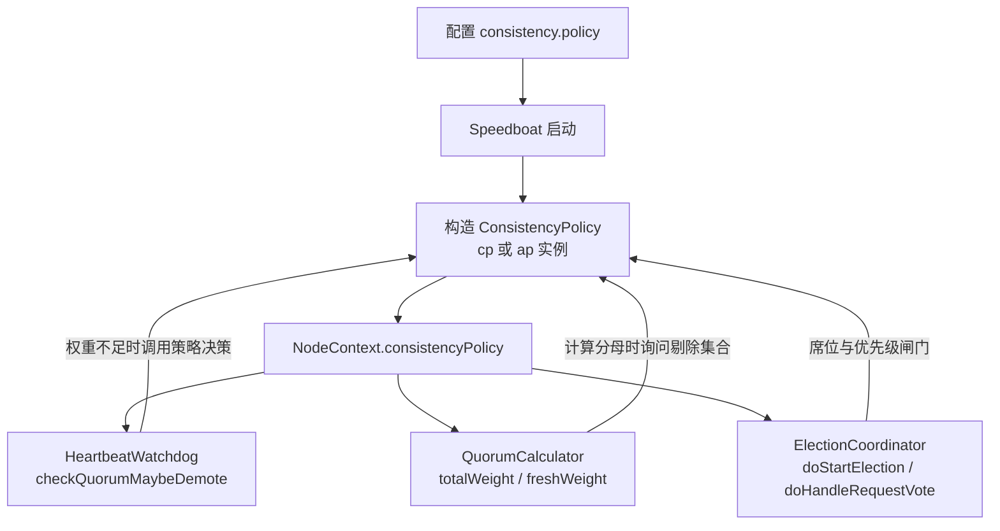
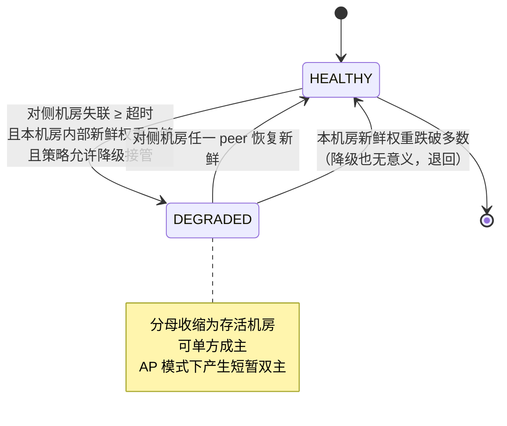

# 一致性策略双模式（CP/AP）设计与阶段六分区方案

- 日期：2026-10-10
- 状态：设计待决策
- 前置：[跨机房级联设计](2026-10-10-03-crossdc-cascade-design.md)（CP 已实现实机验证通过）
- 关联：MANUAL.md、README.md、验证报告 `docs/verification/2026-10-10-crossdc6-cluster-verification.md`

## 1. 背景与目标

跨机房级联的 CP（强一致唯一性）已实现并在六机实机上验证通过：全局 `isMain` 全程 ≤1，四场景 61/61 通过。其代价是"杀光主机房 / 主机房整机房失联时退化为 0 主"，备机房无法自行接管。

本轮两项要求：

1. **一致性策略双模式**：CP 已实现后，AP（允许短暂双主）也要实现。启动时可选择 CP 或 AP，做成策略模式，基于策略执行动作，默认 CP。
2. **阶段六网络分区**：不再依赖六台真实主机（`tomcat` 用户无 sudo、未装 iptables），改在本机用 vboxnet0 模拟两机房真实分区。方案已实测确认可行，见 §9。

## 2. 现状：CP 已实现的行为

CP 的唯一性来自一组**结构性**保证，而非运行期协商：

| 机制 | 位置 | 行为 |
|---|---|---|
| 不对称机房权重 | `datacenter.weight.<ID>` | 主机房 2、备机房 1，total=3、required=2 |
| 分母按机房聚合 | `VoteWeightStrategy.quorumByDatacenter()` | 同机房多 peer 只计一次，避免分母虚增 |
| 席位门控 | `ElectionCoordinator` 四处入口 | 非代表进程不竞选、不投票、不授预票 |
| check-quorum 降级 | `HeartbeatWatchdog.checkQuorumMaybeDemote` | 新鲜权重 < required 时降级 FOLLOWER |

推导：主机房 `self=2 ≥ required=2` 可单方成主；备机房 `self=1 < 2` 不可。故分区/杀光备机房时主机房仍唯一为 1 主；杀光主机房时退化为 0 主。

**CP 明确不含**失联降权/降级接管——这是本设计要为 AP 引回的能力。

## 3. AP 语义与降级接管机制

AP 的目标：主机房整机房失联时，备机房可在超时后自行成主，代价是分区期间可能短暂双主。

### 3.1 降级接管的触发条件

备机房代表（父组成员）需同时满足：

1. 自身处于父组且持有席位（非代表进程无从谈起）；
2. 连续 `degraded.timeout.ms` 内，**对侧机房**无任何 peer 新鲜应答；
3. **本机房**内部新鲜权重足够（否则降级也凑不出多数，无意义）。

三条同时成立才进入 `DEGRADED` 态，避免网络抖动误判。

### 3.2 降级后的分母收缩

进入 `DEGRADED` 后，把失联机房剔除出有效分母：

```text
正常态   ： total = W_main + W_backup = 2 + 1 = 3，required = 2
DEGRADED ： 剔除主机房 → total = W_backup = 1，required = 1
           备机房 self = 1 ≥ 1 → 可发起选举并当选
```

主机房侧不受影响：分区时其机房内部连通，`self=2 ≥ required=2`，仍可保持/取得主。于是分区期间双主——这正是 AP 明示接受的代价。

### 3.3 分区愈合后的收敛

两侧 term 因降级选举而不同，走标准 Raft 任期机制收敛：低 term 的 Leader 收到高 term 消息后降级 FOLLOWER，全网归一为单主。收敛期可能伴随短暂不可用或主切换，属 AP 预期形态。

## 4. 策略模式设计

### 4.1 策略接口

新增 `ConsistencyPolicy`（与 `VoteWeightStrategy` 并列的策略接口），由配置在启动时决定实例，注入 `NodeContext`，供 `HeartbeatWatchdog`、`QuorumCalculator`、`ElectionCoordinator` 在各自决策点调用。

策略需回答的动作点：

- 模式标识（`cp` / `ap`），供日志与监控区分口径；
- 是否允许降级接管，以及降级判定所需的超时时长；
- 遭遇法定权重不足时，执行什么动作（降级 / 进入降级态 / 维持现状）；
- 当前有效分母应剔除哪些机房（CP 恒为空集）；
- 是否处于降级态，以及何时退出。

### 4.2 注入点



关键约束：**CP 路径必须逐字节不变**。CP 实例的 `excludedDatacenters` 恒返回空集、`decideOnQuorumShortage` 恒返回"降级"，即与当前硬编码行为完全等价；既有单机房与六机实机回归必须原样通过。

### 4.3 状态机



CP 实例永不进入 `DEGRADED`，状态机对其退化为恒 `HEALTHY`。

## 5. 上中下三策

三者都是策略模式，差别在于**策略覆盖的动作点范围**与**降级逻辑的组织方式**。

### 上策：完整策略接口 + 独立降级状态机

策略接口覆盖全部动作点（模式标识、降级开关、超时、权重不足决策、分母剔除集合、降级态查询与退出、审计钩子），并引入独立的 `DegradedState` 对象承载失联机房集合与进出时间。`QuorumCalculator` 的全部按机房聚合分支（`totalWeight` / `receivedWeight` / `grantedWeight` / `matchedWeight` / `freshWeight`）统一读取该状态。

- 优点：语义最完整；CP/AP 完全同源，未来 AP 变体（如按链路质量、按人工确认）易扩展；降级态可独立观测。
- 代价：改动面最大，`QuorumCalculator` 六处按机房分支都要接入剔除集合；单测与回归覆盖工作量大；对已验证的 CP 路径触碰点多，需逐处确认不改变 CP 行为。

### 中策：策略接口 + 集中式降级判定（推荐）

策略接口只覆盖核心动作点：模式标识、是否允许降级接管与超时时长、权重不足时的决策、当前应剔除的机房集合。降级判定与失联机房的计算**集中在唯一降级点** `HeartbeatWatchdog`，失联集合由策略持有并对外只读。`QuorumCalculator` 仅在分母聚合入口（`totalWeightByDatacenter` 与 `freshWeight`）读取剔除集合。

- 优点：改动集中，CP 路径逐字节不变；降级判定只有一处，不易出现口径分裂（正是此前看门狗与选举侧口径分裂导致误降级的教训）；回归成本可控。
- 代价：AP 逻辑分布在看门狗与计算器两处；若未来要按机房细分降级粒度，需扩展接口。

### 下策：仅布尔开关 + 分支（不符合要求）

只加一个 `consistency.policy` 配置，在四个决策点直接 `if` 判断。

- 优点：改动最小、最快。
- 缺点：不是策略模式，与"做成策略模式、基于策略执行动作"的明确要求冲突；CP/AP 行为散落在各调用点，难以保证口径一致，也难以扩展。**列出仅为对比，不推荐。**

### 推荐

采用**中策**：它满足策略模式要求，把降级判定收敛在唯一降级点，CP 路径保持逐字节不变，回归风险最低。

## 6. 配置设计

```properties
# 一致性策略：cp（默认，硬唯一性）| ap（允许短暂双主）
consistency.policy=cp

# 仅 ap 生效：整机房失联多久后允许降级接管
consistency.degraded.timeout.ms=10000
```

CP 为默认值，不配置时行为与当前实现完全一致。AP 的超时需显著大于 check-quorum 新鲜阈值（5s）与跨机房选举超时上界，避免抖动误接管。

## 7. 观测与审计

双模式下监控口径必须区分：

| 观测项 | CP | AP |
|---|---|---|
| `isMain` 全网计数 | 恒 ≤1 | 分区期间可能为 2，愈合后归 1 |
| 降级态 | 恒不出现 | 出现 `DEGRADED` 即需告警 |
| term | 平稳推进 | 降级接管时出现大步跃升 |

策略切换、进入/退出降级态、降级接管成主，均需落审计日志（含机房 ID、前后 term、触发原因），便于事后追溯双主窗口。

## 8. 风险与对策

| 风险 | 影响 | 对策 |
|---|---|---|
| 降级误判 | 不该接管时接管，产生非预期双主 | 三条件与门（对侧失联、本机房内部健康、策略允许）+ 超时显著大于抖动窗口 |
| 愈合期 term 冲击 | 短暂主切换或不可用 | 走标准 Raft 任期收敛；AP 明示接受 |
| CP 路径被改动 | 已验证的唯一性回归 | CP 实例行为与当前硬编码逐字节等价；每阶段跑六机 + vbox 回归 |
| AP 被误用于强一致场景 | 数据面不一致 | 默认 CP；MANUAL 补 AP 适用边界与风险警示 |

## 9. 阶段六：vboxnet0 分区方案（已实测）

### 9.1 拓扑

- 主机房 = vbox 三虚机 `debian001/002/003`（`vboxuser@vboxdeb00X`），互信已配、有 sudo；
- 备机房 = 宿主机三个 Java 进程，绑 `0.0.0.0`（与 `NettyTransport` 现状 `bind(port)` 一致，无需改代码）。此处绑全接口是**本测试环境的选择**——宿主机只有一个 vboxnet0 地址可供三进程复用，绑具体地址会让停用后本机进程间一并断开。speedboat 并不因此受限，生产多网卡环境按各自地址绑定同样可行；
- 跨机房链路 = vboxnet0 host-only 网段 `172.22.133.0/24`，宿主机侧 `172.22.133.1`。

### 9.2 分区控制

```bash
# 建立分区（跨房断、两房内部各自连通）
~/bin/disable-vboxnet0
sudo ip addr add 172.22.133.1/32 dev lo     # 保住备机房内部连通

# 解除分区
~/bin/enable-vboxnet0
sudo ip addr del 172.22.133.1/32 dev lo
```

`sudo ip addr add ... dev lo` 是**必需**的一步：备机房三进程的配置地址就是 `172.22.133.1:2100x`，停用 vboxnet0 后该地址从宿主机消失，三进程互连会一并失败，退化为"备机房整体失联"（等价于 kill，失去分区验证意义）。补 lo 别名后，本机进程间改走 loopback 保持连通，而虚机跨机访问仍需经 vboxnet0 物理链路，故断开。

### 9.3 实测证据

| 路径 | 启用态 | 停用 + lo 别名 | 重新启用 |
|---|---|---|---|
| 跨房：虚机 → `172.22.133.1` | 通 | **断** | 恢复通 |
| 备机房内：宿主机进程间连 `172.22.133.1` | 通 | **通** | 通 |
| 主机房内：虚机 → 虚机 `172.22.133.252` | 通 | **通** | 通 |

时间线吻合：停用窗口内跨房探测连续 FAIL，同窗口本机进程间与虚机间全程 OK；重新启用即恢复。三路语义完全符合"两机房网络分区"。

### 9.4 三个已验证的陷阱

1. 备机房进程在本环境若绑 `172.22.133.1` 而非 `0.0.0.0`，停用后本机进程间也断（单地址局限，非 speedboat 约束）；
2. 停用 vboxnet0 会**同时切断宿主机 → 虚机的 SSH**（也走 `172.22.133.25x`），故虚机侧探测必须预置 `nohup` 后台脚本，事后回收日志，不能依赖停用期间的 ssh；
3. 虚机经 NAT `10.0.2.2` 也能访问宿主机，但 speedboat 只连配置中列出的地址，故不影响分区语义。

### 9.5 分区专项断言

分区期间所有节点进程**均存活**（这正是原降级接管会产出双主的场景）：

- CP：全程 `isMain` 计数 ≤1；主机房保持主，备机房退化为 0 主；
- AP：分区超时后备机房降级接管，`isMain` 计数短时为 2；解除分区后愈合归 1。

## 10. 实施计划

1. 阶段五：人工升级 API（`promoteDatacenter` / `restoreDefaultPriorities` / `getPrioritySnapshot`），含优先级表持久化、term 大步跃升、随心跳传播、审计日志；MANUAL 补 §8.6 风险警示。
2. 阶段六：按 §9 实现 vboxnet0 分区专项，CP 模式下断言全程 `isMain ≤ 1`。
3. 阶段七：CP/AP 双模式（本设计 §4–§8），CP 为默认；MANUAL 补配置项与双模式观测口径。
4. 每阶段后跑 `mvn clean test`，重编下发并跑 vbox 回归，阶段六/七另跑分区专项。

## 11. 决策

- **三策取舍**：采用**中策**。效果好则固化；效果一般，后续再找机会走上策。
- **AP 降级超时默认值**：10s（显著大于 check-quorum 5s 与跨机房选举超时上界 5s）。
- 阶段顺序：先阶段五（人工升级）还是先阶段六/七（分区与双模式）。人工升级与 AP 降级接管在"备机房自行成主"上语义相邻，建议先落人工升级，再在其上叠 AP。
