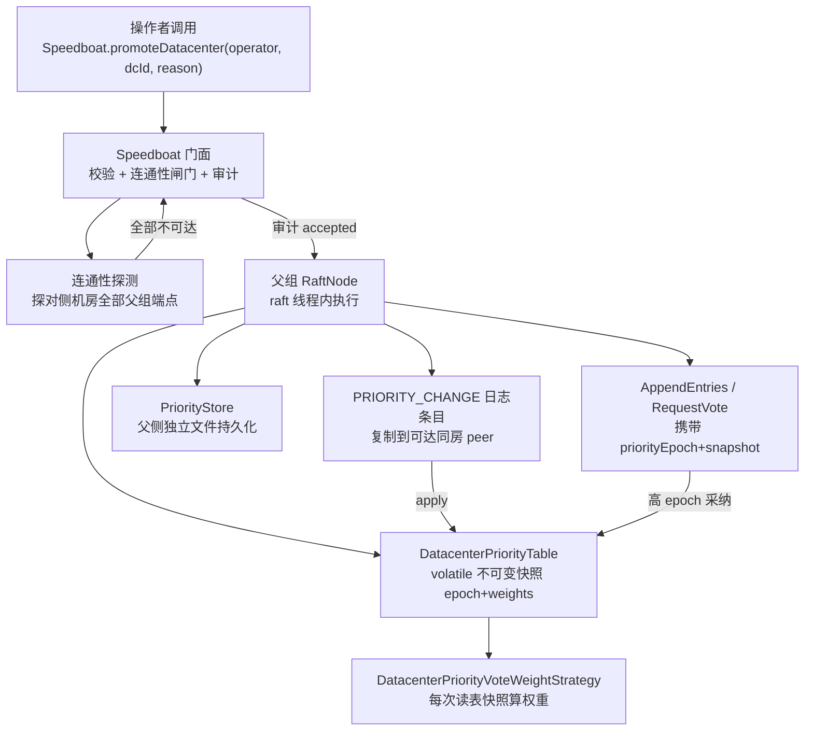
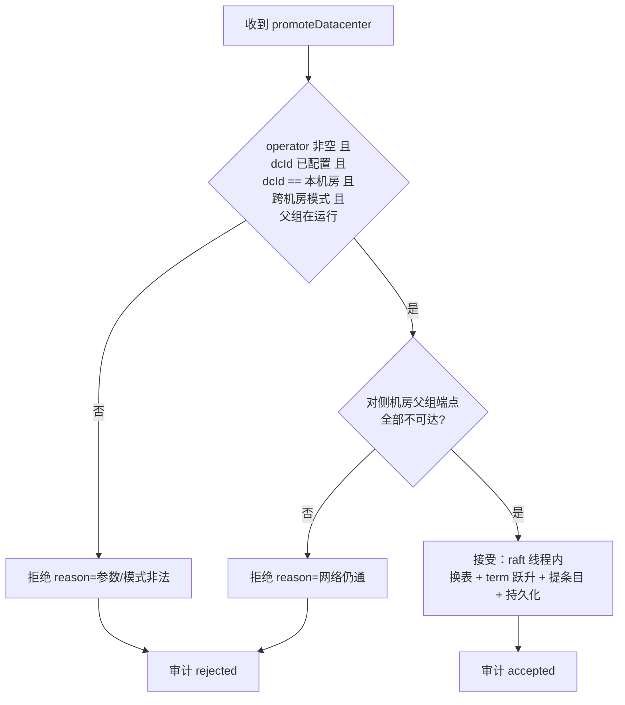
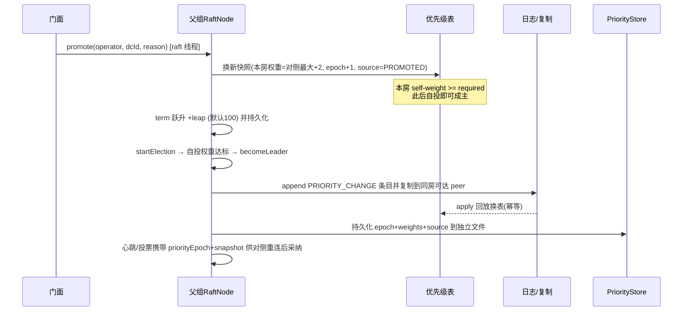

# 阶段五：人工升级 API（运维兜底）设计

> 目标：在跨机房父组中，为"主机房失联/死亡、备机房无法凭自身权重成主"的场景
> 提供一条**显式、可审计、可回退**的人工接管通路。仅通过 Speedboat 门面 API 触发，
> 不提供远程接口、不提供控制台。

## 1. 决策基线（用户拍板）

| 维度 | 决策 |
|---|---|
| 一致性机制 | **上策**：优先级变更作为父组 config-change 日志条目（`PRIORITY_CHANGE`）复制，可达 peer 间强一致 |
| 触发前置 | **仅当主机房与备机房网络不通时允许**；**不提供 `force`** |
| 持久化 | **父侧持久化，单独放一个文件**（不并入 mmap term 档） |
| 审计 | 完整结构化日志：几点几分、操作者（string，必填）、在哪个节点、被接受/拒绝、原因、前后优先级表 |
| 触发面 | 仅 API，不做远程接口、不做控制台 |
| term 跃升 | 默认 **+100**，可配置（`promote.term.leap`） |
| 传播载体 | 随父组**心跳/投票**消息携带优先级快照 + epoch |

## 2. 为什么"网络不通"是硬前置

唯一能破坏"全局 ≤1 主"硬约束的路径，就是在主机房**仅网络分区而非死亡**时强行提升备机房。
把"对侧机房父组端点全部不可达"作为**接受条件**，就把这条破坏路径收窄为：
操作者必须先用带外手段确认主机房确已终止或确已分区。网络仍通时 API 恒拒绝，
系统自动行为的唯一性保证不受人工干预影响。

## 3. 组件拓扑



## 4. 接受/拒绝判定



- **只能提升本机房**：API 在备机房节点上调用、提升备机房自身；提升一个已被探测为不可达的远端房无从引导选举，故 `dcId != 本机房` 拒绝。
- **连通性探测**：对非 `dcId` 机房的**全部父组端点**做 TCP connect（短超时）。任一可达 ⇒ 判"网络仍通"⇒ 拒绝。

## 5. 接受后的执行序（父组 Raft 线程内）



权重数学：设提升房权重 `W_p = max(对侧权重) + 2`，对侧最重 `W_o`。
`required = (W_p + W_o)/2 + 1`。因 `W_p >= W_o + 2`，有 `W_p >= required` ⇒ 提升房自投成主；
又 `W_p + W_o < 2*required`（`required` 严格大于半和）⇒ 双主在结构上不可能。

## 6. 传播（心跳/投票载体）

`AppendEntriesRequest` / `RequestVoteRequest` 追加**可选**字段 `priorityEpoch`（long）与
`prioritySnapshot`（机房→权重 Map）。Protostuff 字段 ID 追加到类末尾，向后兼容；子组不带
这两个字段（缺省 0/null），故子组与单机房路径零影响。接收方仅当 `priorityEpoch > 本表 epoch`
时采纳，构成"只升不降"的单调收敛，主机房重连后以低 term 退让并从心跳学到新表。

## 7. 持久化（父侧独立文件）

`PriorityStore` 读写一个小文本文件（`{persistenceDir}/parent-priority.properties`），存
`epoch` / `source` / `weight.<机房>`。父组启动时若文件存在则以其为初值覆盖配置派生表，
实现"重启不丢提升状态"。不改动 `RaftStore` 接口与其契约测试。

## 8. 回退

`restoreDefaultPriorities(operator, reason)`：以配置派生表为新快照、epoch 递增、source=CONFIG，
走同一条复制 + 持久化 + 心跳传播路径。回退后主机房凭更高权重可在下一次选举夺回，
但**不自动**发生——需主机房代表自身发起选举。MANUAL 警示：切勿自动化回退。

## 9. 审计日志规范

WARN 级、单行结构化，字段固定顺序：

```
PROMOTE-AUDIT ts=<yyyy-MM-dd HH:mm:ss.SSS> op=<accept|reject> operator=<操作者> node=<本节点nodeId> \
  dc=<本机房> target=<目标机房> reason=<拒绝或业务原因> termBefore=<n> termAfter=<n> epochBefore=<n> epochAfter=<n> \
  weightsBefore={...} weightsAfter={...}
```

- `operator` 由调用方必填，空/空白即拒绝（并以 `operator=<missing>` 审计）。
- 接受与拒绝**都**审计，形成完整操作留痕。

## 10. 风险与边界（写入 MANUAL §8.6）

- 在主机房**仅分区而非死亡**时调用仍可能双主——但本 API 已把前置收紧为"对侧父组端点全部不可达"，
  操作者须先带外确认；这是唯一能破坏唯一性的路径。
- 提升后主机房恢复**不自动抢回**席位；夺回需显式回退或主机房代表自行发起选举。
- 仅 API 触发；不提供远程/控制台入口，降低误用面。
- term 跃升默认 100：既保证主机房旧 term 追不上，又不至于一次跃升过大。
